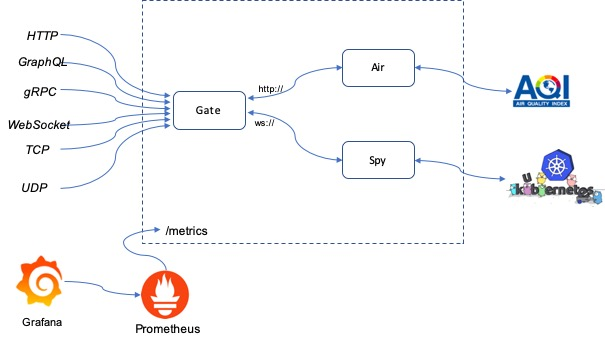

# Go-Bumblebee  


It's sample application with Microservices style on Kubernetes, developers can leverage that to experience various features on Kubernets, such DevOps tooling, observability components, service mesh, etc. 


## Quick Start

### High level architecture 



### Deployment

```bash
$ cd manifests/kubernetes
$ kubeclt -f ./gate-all.yaml
$ kubeclt -f ./air-all.yaml
$ kubeclt -f ./spy-all.yaml

# Checking Go-Bumblebee 
# --- HTTP ---
$ HOSTNAME = `kubectl get svc/gateservice-external -o=jsonpath="{.status.loadBalancer.ingress[0].hostname}"`
$ echo $HOSTNAME
$ curl http://$HOSTNAME:9010/ping
$ curl http://$HOSTNAME:9010/metrics
$ curl http://$HOSTNAME:9010/air/beijing

# --- gRPC ---

# --- GraphQL ---
http://$HOSTNAME:9030/

# --- WebSocket ---
http://$HOSTNAME:9040/
# Simple echo service
http://$HOSTNAME:9040/echo
# Quest Kubernetes resources
http://$HOSTNAME:9030/spy

# --- TCP ---
telnet $HOSTNAME 9050

# --- UDP ---

# --- Web UI ---

```

## Tutorial

### 1. Go-Bumblebee through CI/CD pipleline
Build up CI/CD capabilities around Kubernetes, we have so many ecllecnt choices due to in incredibly rich ecosystem. This tutorial will go with free lunch to taste modernized release pipeline.

- GitHub + CircleCI + AgroCD
- GitHub + CircleCI + Spinnaker


### 2. Manage traffic with Istio
Leverage Istio is a great idea for manage traffic, especially Istio 1.5 was evolved a lot. 


### 3. Improve Observability with Istio

### 4. Enhance security with Istio

### 5. Go-Bumblebee on Knative

