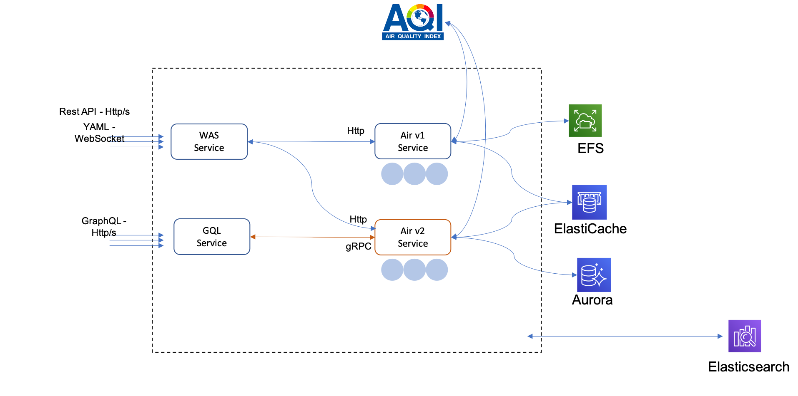

# Go-Bumblebee  

It's sample application with Microservices style on Kubernetes, developers can leverage that to experience various features on Kubernets, such DevOps tooling, observability components, service mesh, etc. 

## Bumblebee-Jazz

- Containerized Microservices
- Multiple Language: Go / Typescript / Python
- Multiple protocols: WebSocket / GraphQL / gRPC / HTTP
- Integration with third parties with secret management
- Storage: Local files / MySQL / Caching (Redis)
- Log analysis: Elasticsearch

## Bumblebee-Jazz's transformation

- Follow Cloud Native style
- Automated release pipeline
- Leverage the power of Kubernetes with best practices 
- With Metrics / Logs / Tracing capabilities
- Infrastructure & Application level SLA
- Securirty is essential 

## How to experiment 

- CI/CD
- Blue/Green deployment
- Canary deployment
- Secret management
- Traffic management
- Observerbility: metrics/logs/tracing
- Load testing
- Authentication

